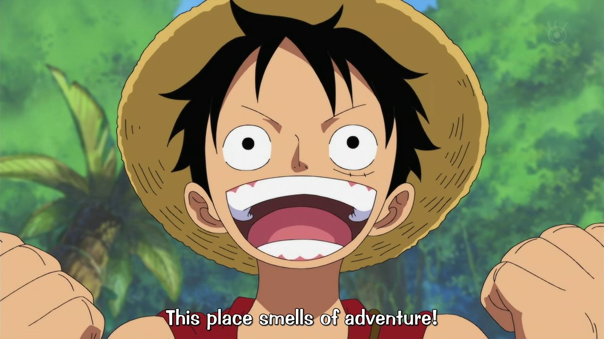



Hi! I'm Nitzan :wave:

I've been in front of computer screens ever since I can remember myself.

Meeting with my friends just to sit together in the study and watch them play
**StarCraft**.

I got into programming rather early, during 4th grade my mom signed me up for an
after school class labeled *"come build computer games with VisualBasic 6!"*, **a
blatant lie**, but nonetheless, I learned to program and got hooked.

It's become exponentially worse since then, to the point where I have a
[program](https://github.com/mastern2k3/html-resume) generate my CV out of a
configuration file.

### Game development

Although I've always been interested in game development, experimenting with
engines and building nonsense games, I owe my newfound passion of game dev to my
friends - my **nakamas**.

Two years ago, me and my friends got committed in becoming a successful game
studio.

It started with a weekly meetup where we'd discuss technology, workshop game
ideas and prototype them, and slowly became a hardened supportive team aimed at
becoming world renowned.

This blog is an attempt at documenting my private endeavors and team efforts in
the adventure of building awesome games.

#### The cat

The cat's name is Sumsum and he's going through a phase.
