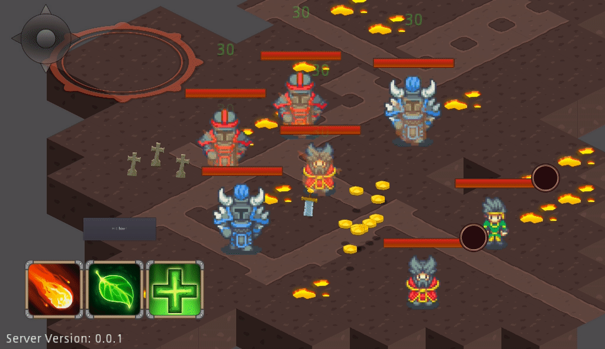

# Moving Around

I haven't had a lot of time to spend on **ToM** development but here's what's
new.

### Map panning

I was glad adding panning, it's one of those features that when added, even
though small, make the overall experience much closer to what you had in mind.

This also opens the door to larger maps, one of my next big tasks on the board.

### Support enemies

I've added some more complexity to playbooks - allowing for enemy actors to
interact with each other.
Currently I have an "Evil Wizard" that locks on a nearby ally and spam-heals it
with the "Healing Winds" ability - previously only used by player actors.

While hacking to implement this I also noticed I end up spending a large amount
of time writing character querying logic code (i.e. get all enemy characters in
proximity, get ally characters, etc.), so I added character querying
abstractions making things easier.

## Next up

* **Enraged enemies** - Will require playbook trigger functionality and a
  basic buff system.

* **Classic map** - A nicer looking map, enemy placement and playbooks as a
  draft for a "classic" enemy engagement.

  I expect this to take a while since currently all combat related variables are
  arbitrary (range, damage, HP, etc.).
