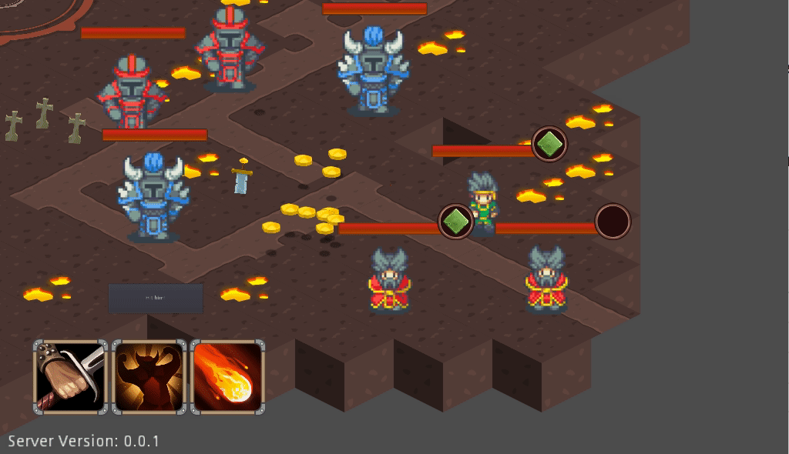
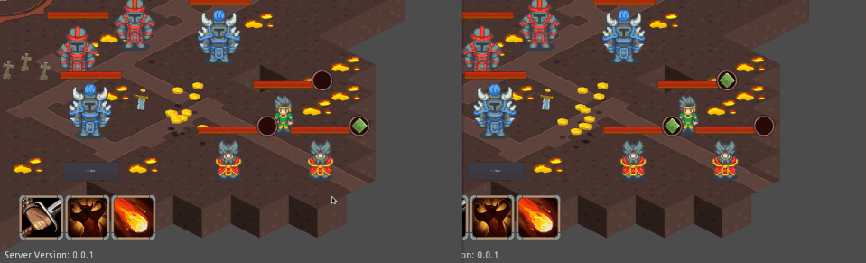

# Three months in

I figured it's time to start recording what I'm up to with **Throne of
Mithrill**, so, here it goes.

Although C# has been giving me a lot of trouble I've managed to design things
stable enough to start putting in some of the basic mechanics, although I might need to port
everything to either Rust or Go.

First were the movement and engagement "orders" (as they once were called) got
implemented.

Then, the server and aggression system, allowing enemy mobs to strike back when a player entered proximity.  
If you're observant enough you'll notice the exclamation effect over the enemy
knight guy's head as he approaches the player and a focusing circle on the
triggering player.

The exclamation mark came in as an indication I put in to test the message was
being processed correctly, I added the rotating circle later to emphasize and
alarm the player.

It was important for me that the game would be built designed around the
multiplayer experience, so, synchronization and match authorization came almost
immediately.

Since at this point the characters' ownership is given semi-randomly by the server, I found it helpful to add **ownership indicators**, however crude.

You can also notice the movement, auto-attack and auto-heal command interface.  
The like will snap and change colors according to the default offensive /
supportive ability of a character (in case they have one) or blue for simple
movement.

Aside from the default offensive / supportive auto-abilities (which could later be selected by the player), characters can also use actionable abilities.  
I started with a simple circular AOE as a proof of concept but more will come.

A casting system is also in place, enforcing a vulnerability when casting.

## More things in the works

* **Aggro system** - Although it's hard to notice there is an aggro system I'm
  work-shopping.  
  Damage afflictions and heals cause enemies to redirect their
  attention. It is very sensitive at the moment, causing redirections too often.

* **Looting system** - You might have noticed enemies dropping coins when they die
  or the coins in the middle of the screen, those are collectible and a recent
  refactoring caused the characters to stop collecting them.
  Later enemies will drop other kinds of loot and one-time usables.

* **Enemy playbooks** - When engaged, enemies execute a "playbook" -
  a highly customizable and pluggable state machine.  
  Currently said state machines are very simple, enemies start auto-attacking
  their aggressor and use an ability periodically, but, soon I want to add enemy
  healers which will put my design to the test.

## Trajectory

* **Platforms** - I still have a lot to figure out regarding **Godot**. C# has
  been giving me trouble, so I'm looking into utilizing the GDNative bindings with
  either Go or Rust.

* **Complex playbooks** - Enemies are not really threatening at the moment, so I
  want to introduce a support-type enemy and an enrage mechanic.

* **Buff system** - As part of introducing an enrage mechanic I'll be adding a
  basic buff system, allowing me to apply effects for variable periods of time.

* **Bosses** - Once the buff system and new playbooks are in place I'll start
  experimenting with more complex maps and bosses.

  I am set to build a team-oriented game and I want bosses to play an important
  role, soon I'll be posting some drafts for the first boss encounter.
