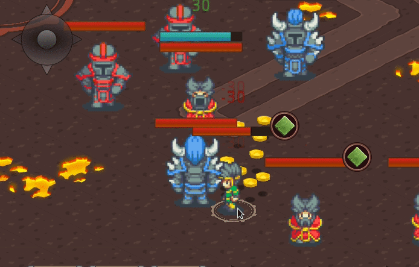
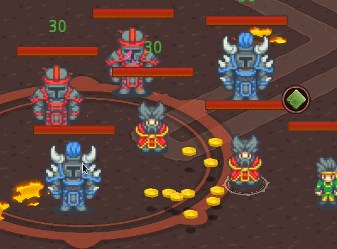
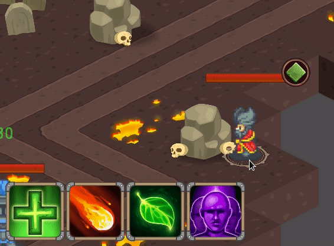
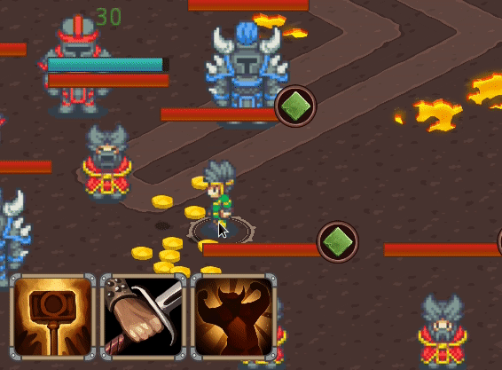

The task of adding character buffs to the game required adding some cool
complexities to the state engine, including stat effects, allowing transient
alterations to the character's stats, and state slots enabling characters to
act-out multiple effects at a time.

### Buff system and triggers

The buff system took much thinking but little actual code, I ended up designing
it as part of the already existing character state machine module.

The task leading to adding the buff system was implementing an "enrage" mechanic,
causing an enemy to apply a buff to himself when it's hp falls under a certain
amount, for that, I added trigger semantics allowing me to implement various
types of triggers.

 

Trigger semantics were designed with boss encounters in mind so that bosses
could play out different phases of an encounter based on different triggers.

### Stat effects

Although currently the damage inflicted by melee attacks is a simple flat value
associated with the character, I wanted to add a semantic allowing me to apply a
transient change to it.

Stat effects simply allow for the adding / removing of stat altering components
that trigger a recalculation of the character's effective stats when applied.

The "enrage" buff described above uses a stat effect, adding 15 melee damage to
the effected character.

### On-the-fly character creation

 

This might not look too glamorous but it is an important milestone for cooler
features I want to have, like:

* Bosses summoning adds
* Enemy "Nests" that keep spawning enemies unless destroyed
* Character abilities that spawn allies

## Small Changes

* **Version imprint** - Build process now "watermarks" a version string based on
  version control tags and hashes, visible also on the client display.

* **Heals cause aggro** - Friendly heals cause aggro to nearby enemies and may
  redirect attention to the healer.

* **Cast breaking** - Cast-breaking semantics now enable abilities and buffs to
  break spell-casting.

