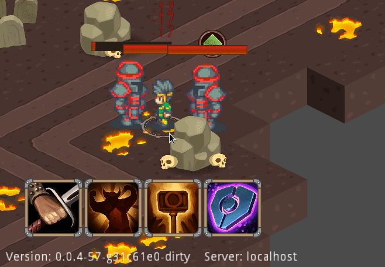
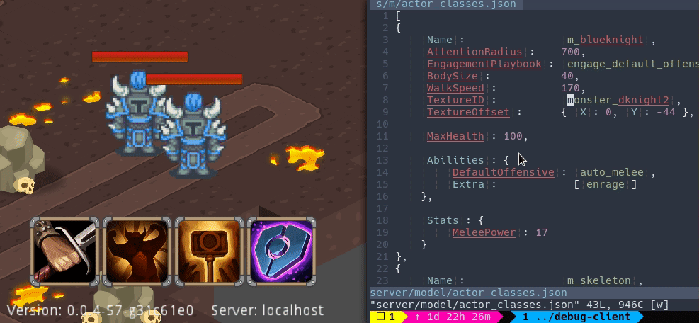
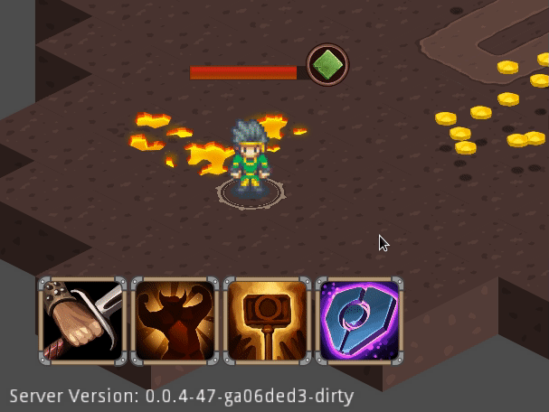

The last week was a fun milestone. Up until recently, although the game was
playable, you couldn't really get the characters to do what you had in mind for
them.

A few behaviors expected from an RTS were missing:

* **After executing an ability on an enemy the character would stand idle.**  
  The expected behavior is to continue with the default auto attack which is
  what I ended up implementing.

* **After killing an enemy the character would always stand idle.**  
  This is pretty much the expected behavior except in the common scenario where
  there are still nearby enemies, in which case it should continue attacking the
  next nearby enemy.

On top of those, combat parameters like damage, healing done and cooldown times
were never given more than an afterthought.

To get those in order, while spending as little time as possible on development
tasks I had to implement some tooling.

## Hot reloading

Since most of the game logic is taking place on the server, tuning combat
parameters and repositioning characters created the constant hurdle of
re-deploying the server, so, in order to prototype more rapidly I ended up
implementing two hot reloading features allowing me to prototype while avoiding
re-deployment.

#### Map reloading

Although I did not mention this before, the way the server knows how to
instantiate a map is through loading the map scene file from the game editor. So
until I settle on a more dynamic solution, the map has to be prepackaged with
the server deployment.

Until I implement a more complete solution for server map loading I added a
debug map loading RPC, allowing me to hot-load an alternative map to the main
map to be used by the server without having to restart it.

#### Character definition reloading

All characters on the map are loaded through character "templates" that, until
recently, were hard-coded in the server. Again, forcing me to restart the server
to implement changes.

Here I wanted more leeway. I wanted to be able to change character
specifications way more rapidly because I'm predicting a lot of minute tuning
will be required for those, possibly during an active match.

*That* required two things:

1. Character "templates" should be serializable to allow editing and
  transmission while the server is up. I landed on a simple JSON containing all
  parameters.

2. A server RPC allowing the injection and re-instantiation of new character
  "templates" while a match is running.

To make the solution more complete I also ended up developing a helper tool
that, when directed, watches a local file for changes and injects the new
contents to the server.

All this required a lot of work but the end result is satisfying.

### Additional progress

* **Breakthrough with native client**  
  Although I've overcome most problems with Godot's C# runtime, there's no
  denying the benefits of a native build. In the past few weeks I've managed to
  successfully tie up my critical dependencies (WebSockets, OpenAPI and Godot)
  under Rust using the [godot-rust] native tool repo, ensuring that door is
  open.

* **Dedicated server**  
  As the first step toward publishing a playable "test-demo" I've set up a
  dedicated ToM server ready to host matches. The server is working perfectly
  and in the next week or so I'll publish a "test-demo" allowing me and curious
  gamers to showcase and test the game mechanics.

* **Self targeting abilities** - As part of adding a new "Shield" ability, I've
  implemented self targeting logic to enable abilities targeted at the caster.

## Next up

* **Test demo** - A playable demo designed toward showcasing and testing game
  mechanics on top of the new dedicated server.

* **Start map** - Now that the base mechanics are working well I've begun to
  work on the starting map, which will contain an introductory cutscene some
  basic battle situations and the first miniboss.  
  **God I'm excited.**

[godot-rust]: https://github.com/GodotNativeTools/godot-rust
