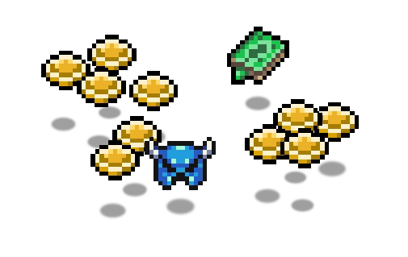
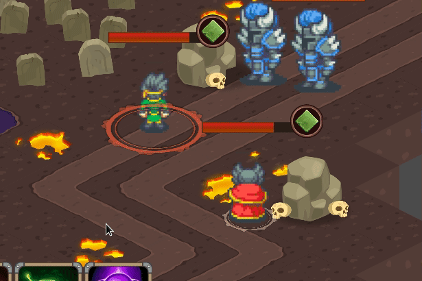
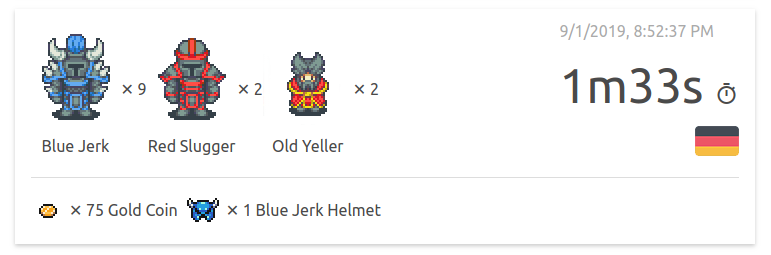

# {{ $page.title }}

> And they're like, gimme more of them pixels

As [promised back in June], I've refactored the whole collectible item aspect.

The server holds configurable rules that determine which and at what rate items
drop from enemies and makes them sprout from monsters accordingly.

Other than that, at the moment, collecting items doesn't really do anything
in terms of gameplay.

Although, just like monster kills, collected items are recorded and displayed
on the [demo match board] so be sure to check your spoils.

## Next up, better controls, survival map

In the last few weeks I've gathered a hefty list of broken controls which will
be next on my plate:

* **Player selection** - Currently a click on a player character causes it to
  both get selected and move. This causes a cancellation of the last given order
  (usually attacking) which is very annoying. A fix for that is coming soon.

* **Auto panning** - Currently panning the game map is available only through
  the top-left joystick. This is both inconvenient and slow, so, next I'll be
  experimenting with automatic panning, following the characters and enemies
  in a center-of-attention manner.

* **Ability range indication** - Although some abilities have a maximum cast
  range to them, this is not reflected in the UI, making out-of-range ability
  commands not work, without any indication to why.

* **Annoying health bars** - Currently, health bars are displayed above all
  characters, at all times. This is highly inconvenient and will be one of the
  next things I'll be dealing with.

As to the starting map [mentioned before], it appears to may take more time
to build than I've thought. Therefore, as a milestone before that, I'll be
implementing a survival type map where waves of enemies approach the two
characters in the middle, with the end goal of surviving as long as possible.

As mentioned before, I would gladly appreciate any kind of feedback, either here or on [itch.io](https://mastern2k3.itch.io/tom).

    <iframe frameborder="0" src="https://itch.io/embed/442046?linkback=true&amp;fg_color=2c3e50&amp;link_color=3eaf7c" width="552" height="167"></iframe>

[promised back in June]: ./2019-06-08-three-months-in.md#more-things-in-the-works
[demo match board]: /throne/results.md
[mentioned before]: ./2019-07-14-time-to-play.md#next-up
