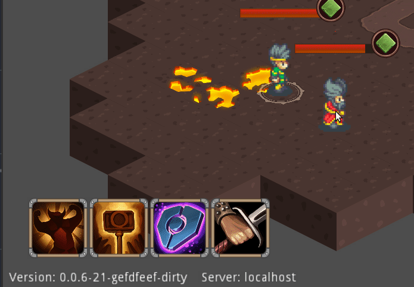
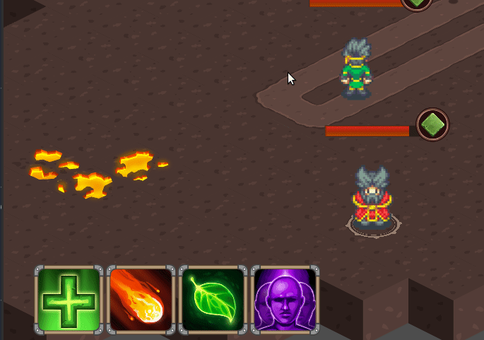
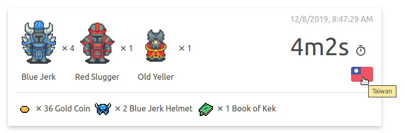

As discussed in the [previous post], the subject of this latest version is
improving controls.

### Player selection

Clicking or dragging a player character now causes selection, meaning their
skill bar will appear.

In addition, many players tried right-clicking the ground as a means of
commanding a move, just as expected in almost every RTS, so I also added a
much expected right-click move command.

### Ability range indication

Trying to use a range limited ability now shows the player's required proximity.

Issuing an out-of-range action will result in the character first, reaching
required proximity, and only then, executing the cast.

### Auto panning

Although simple and not entirely tested, I've added automatic panning so the
camera follows the average point between all player characters.

I feel it is a net positive that needs further tweaks, that's overall better
than the manual way. It still leaves an unsolved problem of sometimes requiring
a manual way of controlling the viewport, but, I guess that'll have to be fixed
later when I have more feedback and better solutions.

## The "Book of Kek" was acquired!

As introduced in the last version, enemies now drop items.
And I am proud to announce that the rarest, among the ones released, has been
acquired, courtesy of **Taiwan!**

I didn't intend on this item being a rarity, but, since most testers don't manage
past the first group of enemies, reaching the **"Old Yeller"** and getting the
book was a happy moment for me.

This accomplishment as well as all recently played matches and their results are
available for browsing on the [match board].

Hopefully this new version will get new player past the hump of needing to pan
the viewport.

## Coming Next, Balancing, Survival Mode

Now that the major control issues are addressed I can showcase the game to
less forgiving players (without them tripping on the minor control problems).

So, unless some major issues arise from feedback, I'll be focusing on gameplay.

* **Balancing** - Although I'm still unsure how to approach it, the skills and
  open variables in the game are still unbalanced. A great example of this is
  the fireball skill of the wizard, easily taking down enemies from afar without
  risking too much.

  Hopefully implementing a survival mode will make it easier to prototype
  balancing those variables.

* **Survival Mode** - As mentioned in the last post, and for the sake of more
  easily testing and balancing gameplay, I'll be implementing a survival type
  map where waves of enemies approach the characters in the middle, with the end
  goal of surviving as long as possible.

As mentioned before, I would gladly appreciate any kind of feedback, either here
or on [itch.io](https://mastern2k3.itch.io/tom).



[previous post]: ./2019-09-10-my-items-bring-all-the-boys-to-the-yard.md
[match board]:   
