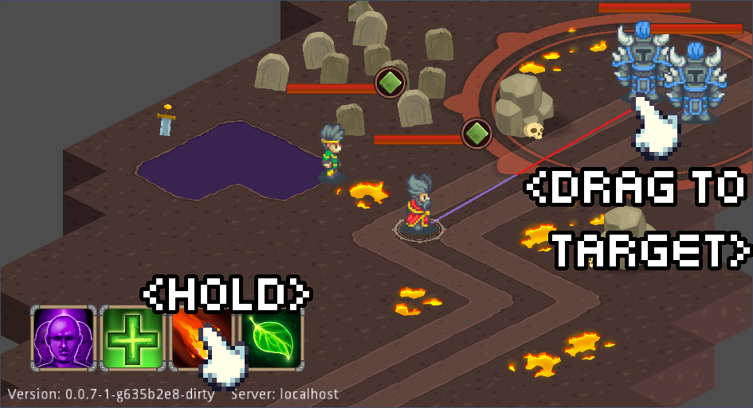

I've been waiting for the [3.2 version of godot] to release for some time and
alas it has, bringing with it the much needed support for **Mono on Android**.

Although playable on desktops, I'm very excited about the prospect of
showcasing the game for potential testers on their mobiles.

Although technically a click away in the new Godot version, creating an Android
version wasn't easy, several mechanics broke and some didn't make sense on a
mobile and had to be upgraded.

## Draggable Ability Casts

One issue with making the Android port feature complete compared to the current
versions had to to with casting abilities.

An important part of casting abilities is being able to position them well,
making sure the cast will affect certain enemies or friends, which was made
possible with the mouse hover.

In order to replicate this ability I had to introduce a new behavior, allowing
a cast command with a drag motion.

The results were way better than expected, this kind of control is exactly what
I've been hoping for!

As mentioned before, I would gladly appreciate any kind of feedback, either here
or on [itch.io](https://mastern2k3.itch.io/tom).



[3.2 version of godot]: https://godotengine.org/article/here-comes-godot-3-2
