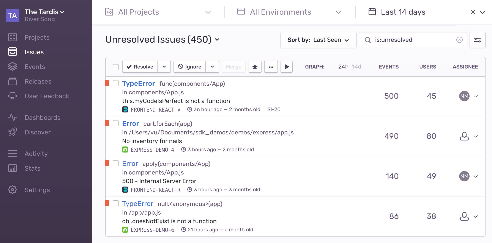
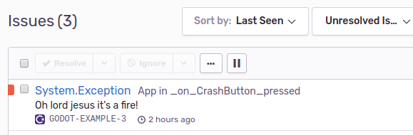
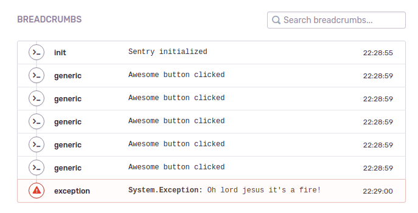

I'm a big fan of the Godot game engine, and lately, since players have been
testing the game more often, I've decided to add some monitoring solution to
get a better view of what's failing players as they try to play.

In this post I'll show how to integrate Sentry's .Net SDK in Godot and use
it to receive usage reports and error monitoring.


## What's Sentry?

Sentry is an open-source error monitoring tool I picked up on a while ago.

I initially started using it because it was open-source and I was quite the
cheapskate, but, it really is an **awesome** and **visually delightful** tool.

Aside from collecting error reports and alerting you when the application fails,
it makes it simple to integrate information and events **you** care about in
those reports. Also, it's fairly **easy to integrate** and get started
collecting data with, **even if** you're not that much of a friend to coding.



So, if you want a dashboard filled with reports about **how your game crashed**,
to **who**, **why** and what were they doing leading to the crash,
**keep reading.**


## Dependencies

First, let's grab the required binaries. Installing the Sentry SDK collects a
few other assemblies so I added all of them to one `packages.config` for
convenience:

```xml
<?xml version="1.0" encoding="utf-8"?>
<packages>
  <package id="Sentry" version="2.1.0" targetFramework="net45" />
  <package id="Sentry.Protocol" version="2.1.0" targetFramework="net45" />
  <package id="Sentry.PlatformAbstractions" version="1.1.0.0" targetFramework="net45" />
  <package id="System.Collections.Immutable" version="1.5.0" targetFramework="net45" />
</packages>
```

Run **NuGet** to fetch all those into your project's `./packages/` folder.

```sh
$ mono nuget.exe restore
```

> If you don't have **NuGet** yet you can grab it [here][nuget downloads].  
> The **Windows x86 Commandline** version is runnable using mono.

Add references to the Sentry assemblies to your project:

```xml
<ItemGroup>

  <Reference Include="Sentry, Version=2.1.0.0">
    <HintPath>$(ProjectDir)/packages/Sentry.2.1.0/lib/net461/Sentry.dll</HintPath>
    <Private>True</Private>
  </Reference>

  <Reference Include="Sentry.Protocol, Version=2.1.0.0">
    <HintPath>$(ProjectDir)/packages/Sentry.Protocol.2.1.0/lib/net46/Sentry.Protocol.dll</HintPath>
    <Private>True</Private>
  </Reference>

  <Reference Include="Sentry.PlatformAbstractions, Version=1.1.0.0">
    <HintPath>$(ProjectDir)/packages/Sentry.PlatformAbstractions.1.1.0/lib/net471/Sentry.PlatformAbstractions.dll</HintPath>
    <Private>True</Private>
  </Reference>

  <Reference Include="System.Collections.Immutable, Version=1.2.3.0">
    <HintPath>$(ProjectDir)/packages/System.Collections.Immutable.1.5.0/lib/portable-net45+win8+wp8+wpa81/System.Collections.Immutable.dll</HintPath>
    <Private>True</Private>
  </Reference>

</ItemGroup>
```


## Initialization

Using Godot we don't really have an initialization section so I created a
dedicated node (here as `SentryController`) to hold the Sentry initialization
logic.


> **Pay close attention** to the node placement in the scene tree.
> 
> The Sentry controller node must come before any application nodes.
> Godot invokes their `_Ready()` methods according to their ordering on the tree,
> and any exception thrown before SDK init will **not be reported**.

After creating an account and a project Sentry will suggest an initialization
clause with your project's **Dsn**, similar to this:

```csharp
using (SentrySdk.Init("https://451cf9b0fd9e4f0294a0d15b6c36bce2@sentry.io/5170198")) {
    // App code
}
```

> After creating a project [this page][Sentry quickstart page] will contain code
> examples with your project's Dsn in place.

So after adding it to your node it should look somewhat like this.

```csharp
public class SentryController : Node {

    public override void _Ready() {

        SentrySdk.Init(o => {
            o.Dsn = new Dsn("https://451cf9b0fd9e4f0294a0d15b6c36bce2@sentry.io/5170198");
        });
    }
}
```


## Error reporting

Now that the client is set up, any unhandled exceptions thrown will get
reported to the sentry API, and appear on your dashboard with a full trace.

For example, lets set a button that throws an exception:

```csharp
public class App : Node2D {

	private void _on_CrashButton_pressed() {
		throw new Exception("Oh lord jesus it's a fire!");
	}
}
```

Which after getting pressed will cause an error to appear on your issue
dashboard.




## Breadcrumbs

A neat feature of Sentry that I had to cover.

This allows you to log the user's behavior, potentially, leading to the error.
Giving you a better view into what exactly happened before the crash.

The code is fairly simple, for example, lets log a button click *(exciting, I
know :P)*.

```csharp
public class App : Node2D {

    ...

    private void _on_AwesomeButton_pressed() {
        SentrySdk.AddBreadcrumb("Awesome button clicked");
    }
}
```

After a few clicks on this button, and then, a hit to the ol' crashing button,
we'll get this neat report:




## Example Project

I've prepared an example project demonstrating the Sentry integration here:

<https://github.com/mastern2k3/godot-sentry-example>

There is a small caveat for people looking to export for Android, read ahead.


## Android

Although making all this goodness to work on Android should've been an export
prest away, things turned out to be trickier.

The Android prest kept failing the mono assembly preparation phase because of
an apparent missing assembly named `System.Web`.

```
ERROR: get_assembly_dependencies: Cannot load assembly (refonly): 'System.Web'.
   At: modules/mono/editor/godotsharp_export.cpp:93.
ERROR: get_assembly_dependencies: Cannot load one of the dependencies for the assembly: 'Sentry'.
   At: modules/mono/editor/godotsharp_export.cpp:98.
```

Finding the answer to this little bugger took me a good two days of research,
trial and error, so I'll cut to the chase.

After digging through the [.Net Sentry SDK] I found out that the `System.Web`
assembly (required by the `net461` variant of the `Sentry.dll` assembly) is not
a strict requirement, and that on other framework outputs its reference is
omitted.

So, on the last trial, I ended up [forking the SDK] in an attempt to produce a
`Sentry.dll` that did not reference `System.Web`.

You can download a compiled version of it [here](https://github.com/mastern2k3/sentry-dotnet/releases/tag/2.1.0-godot).

Important: The example project references the compiled fork version so it
appears as such in the `.csproj` file:

```xml
<Reference Include="Sentry, Version=2.1.0.0">
  <HintPath>$(ProjectDir)/../forks/sentry-dotnet/src/Sentry/bin/Release/net461/Sentry.dll</HintPath>
  <!-- <HintPath>$(ProjectDir)/packages/Sentry.2.1.0/lib/net461/Sentry.dll</HintPath> -->
  <Private>True</Private>
</Reference>
```

If you're not interested in any of this Android nonsense you can comment /
uncomment whichever line fits your needs.


## Other Sentry related stuff you should check out

* [Sentry Scopes] - these enable you to add more info (like user identification)
  as application usage progresses.

* [Self hosting Sentry] - yeah, you can do that.


[Sentry Scopes]: https://docs.sentry.io/enriching-error-data/scopes/?platform=csharp
[Self hosting Sentry]: https://docs.sentry.io/server/

[nuget downloads]: https://www.nuget.org/downloads
[Android version]: ./2020-03-09-godot32-android.md
[.Net Sentry SDK]: https://github.com/getsentry/sentry-dotnet
[forking the SDK]: https://github.com/mastern2k3/sentry-dotnet
[Sentry quickstart page]: https://docs.sentry.io/error-reporting/quickstart/?platform=csharp
